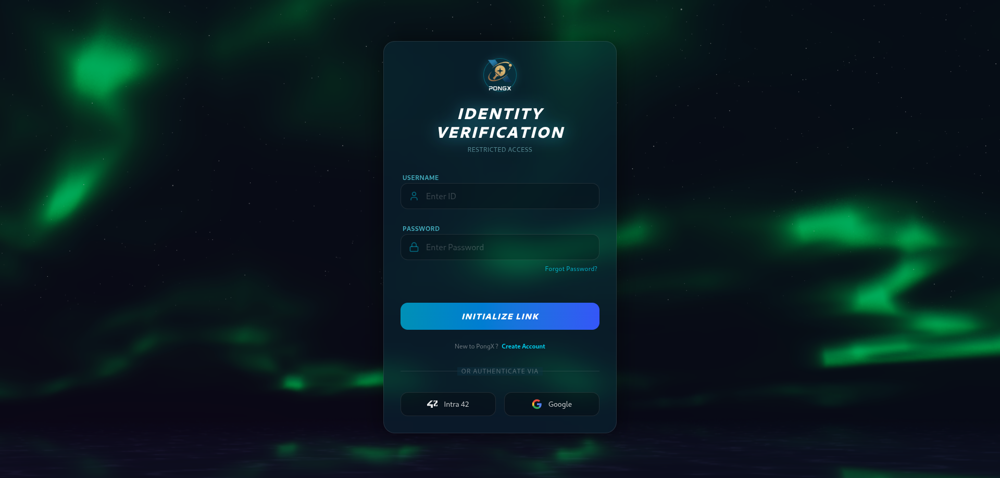
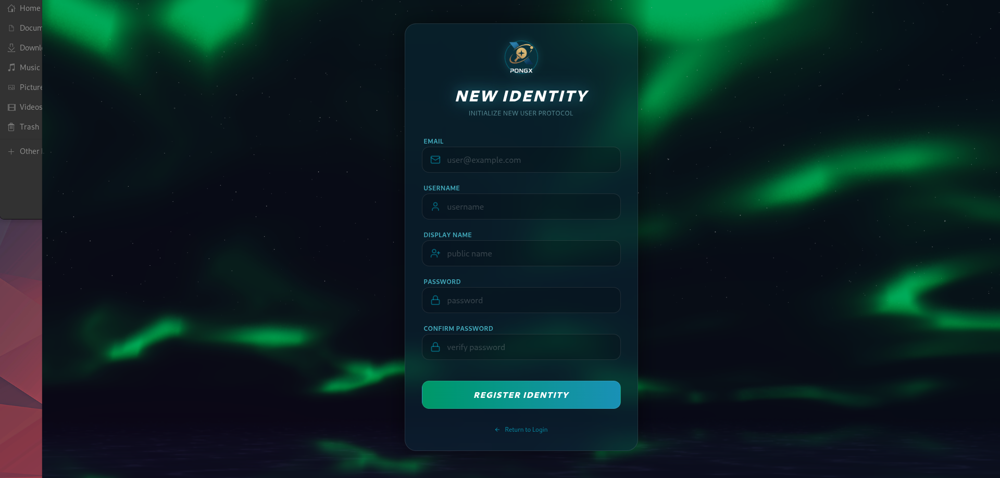
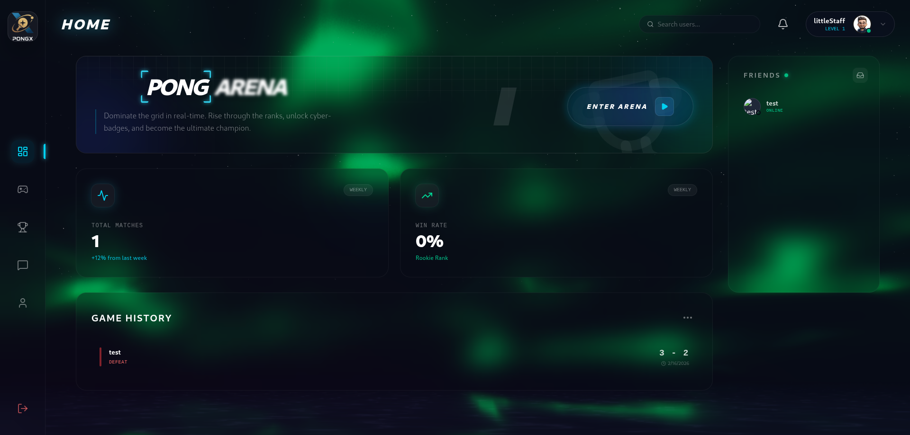
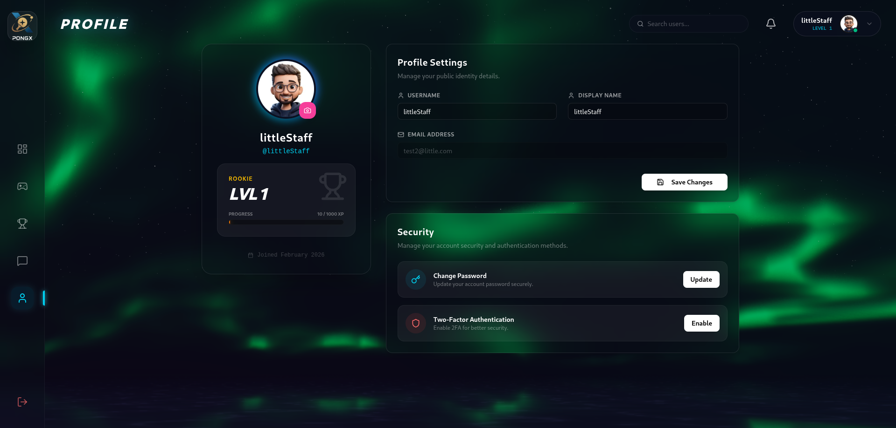
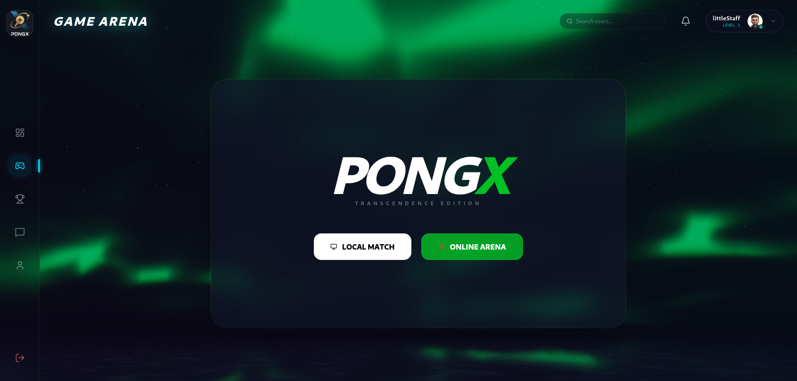
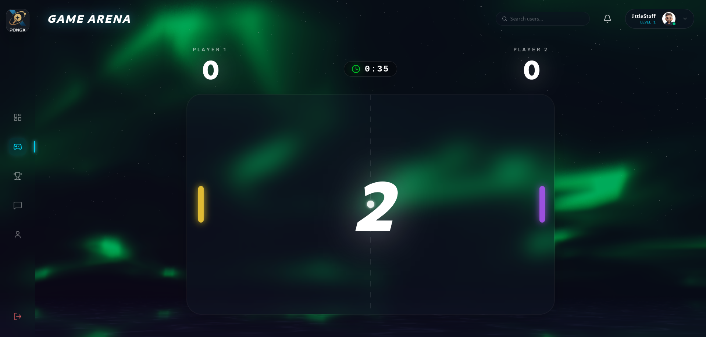
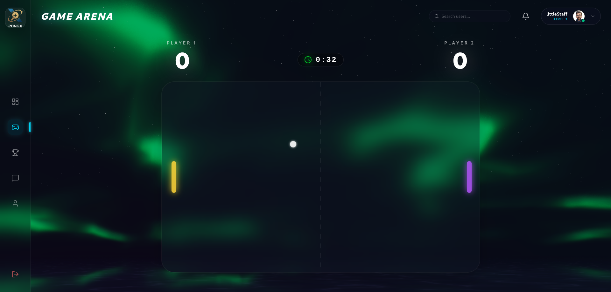
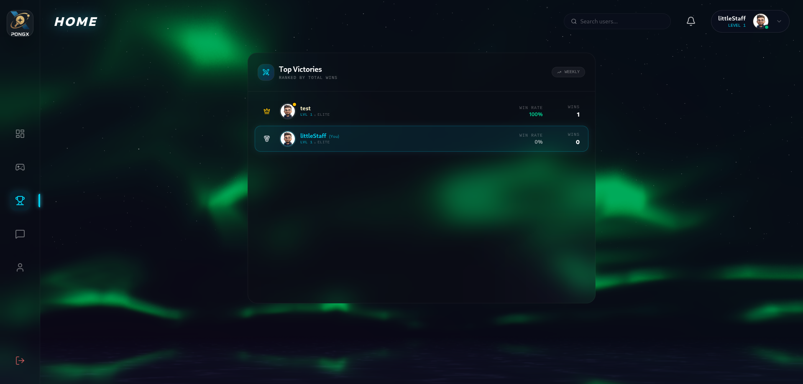
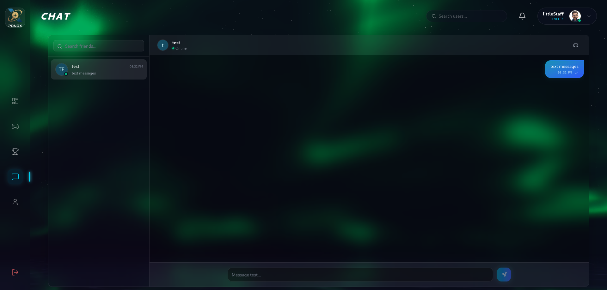
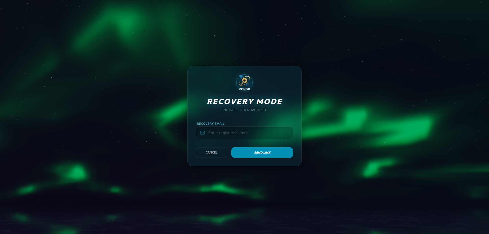

*This project has been created as part of the 42 curriculum by rmoutaou, mel-farg, aderraj, serraoui, aghergho.*

# ft_transcendence

## Description

**ft_transcendence** is the final project of the 42 Common Core curriculum. It is a robust, full-stack web application designed to host a real-time multiplayer Pong game with a focus on enterprise-grade infrastructure, security, and user experience.

Beyond the game itself, the platform offers a complete social ecosystem including user profiles, real-time chat, friend management, and matchmaking. The project was built with a strong emphasis on DevOps and Cybersecurity best practices, featuring a containerized microservices architecture, a Web Application Firewall (WAF), centralized secret management, and a comprehensive monitoring stack.

### Key Features
* **Real-time Multiplayer Pong:** Low-latency gameplay supporting local and remote matches.
* **3D Graphics:** Immersive 3D environment built with Three.js and React Fiber.
* **Advanced Security:** ModSecurity WAF and HashiCorp Vault for secrets management.
* **Observability:** Full ELK stack for logging and Prometheus/Grafana for metric monitoring.
* **Social Suite:** Friends system, live chat, and game invitations.
* **Authentication:** Robust system supporting Local Auth, 42 OAuth, Google OAuth, and 2FA.

## Preview

| | |
|:---:|:---:|
|  |  |
| **Login** | **Register** |
|  |  |
| **Dashboard** | **Profile** |
|  |  |
| **Game Lobby** | **Game Start** |
|  |  |
| **Game** | **Leaderboard** |
|  |  |
| **Chat** | **Forgot Password** |

## Instructions

### Prerequisites
To run this project, ensure the following tools are installed on your machine:
* **Docker Engine** (v24.0+)
* **Docker Compose** (v2.0+)
* **Make**
* **Git**
* **Node.js** (v18+) & **npm** (for local development scripts)

### Installation & Execution

1.  **Clone the repository:**
    ```bash
    git clone https://github.com/aderraj/ft_transcendence.git
    cd ft_transcendence
    ```

2.  **Environment Setup:**
    Copy the example environment file and configure it.
    ```bash
    cp .env.example .env
    # Open .env and add your OAuth credentials (42 & Google) and secure passwords.
    # Set HOST_IP to your machine's IP address if testing on a network.
    ```

3.  **Launch the Application:**
    Build and start all services (Backend, Frontend, Database, WAF, Vault, ELK, Monitoring).
    ```bash
    make
    ```
    *Note: The first startup may take a few minutes as SSL certificates are generated and containers are built.*

4.  **Access the Services:**
    * **Main Application:** [https://localhost](https://localhost) (Accept the self-signed certificate warning)
    * **Vault UI:** [https://localhost:8200/ui](https://localhost:8200/ui)
    * **Kibana (Logs):** [https://localhost:5601](https://localhost:5601)
    * **Grafana (Metrics):** [http://localhost:3003](http://localhost:3003)

5.  **Stop the Application:**
    ```bash
    make down
    ```

## Team Information

| Team Member | Role | Responsibilities |
| :--- | :--- | :--- |
| **rmoutaou** | **DevOps & Security Lead** | Managed infrastructure, WAF configuration, Secrets Management (Vault), and the Observability stack (ELK, Prometheus, Grafana). |
| **mel-farg** | **Backend Lead** | Designed the API architecture, managed the PostgreSQL database & Prisma ORM, and implemented core authentication logic. |
| **aderraj** | **Frontend Lead** | Built the React UI/UX, handled state management, responsive design, and integration with the backend API. |
| **serraoui** | **Real-Time Communication** | Implemented the Chat system, Gateway functionality, Direct Messaging, and Social features (Friends/Blocking). |
| **aghergho** | **Game Developer** | Developed the core Pong game logic, Three.js 3D rendering, physics engine, and matchmaking system. |

## Project Management

### Work Organization
We adopted an Agile/Scrum methodology:
* **Sprints:** One-week sprints with specific goals (e.g., "Basic Auth", "Game Physics").
* **Meetings:** Daily stand-ups on Discord to discuss progress and blockers; Weekly code reviews before merging to `main`.
* **Distribution:** Tasks were strictly divided by domain (DevOps, Backend, Frontend, Chat, Game) to ensure specialization while maintaining a cohesive codebase.

### Tools Used
* **Task Tracking:** GitHub Projects
* **Communication:** Discord
* **Version Control:** Git & GitHub (Feature Branch Workflow)

## Technical Stack

### Frontend
* **Framework:** **React** (via Vite). Chosen for its component-based architecture and vast ecosystem.
* **Language:** **JavaScript/JSX**.
* **Styling:** **Tailwind CSS**. Allows for rapid UI development and consistent design tokens.
* **3D Graphics:** **Three.js** (@react-three/fiber). Used to render the 3D Pong game environment.
* **State Management:** React Context API.

### Backend
* **Framework:** **NestJS**. Chosen for its modular architecture, TypeScript support, and widespread enterprise adoption.
* **Language:** **TypeScript**. Provides type safety and better developer experience.
* **Runtime:** Node.js.
* **Communication:** **Socket.io** for real-time game state and chat; REST API for standard CRUD.

### Database
* **System:** **PostgreSQL**. Chosen for its reliability, relational integrity, and strong support for complex queries needed for matchmaking and user relationships.
* **ORM:** **Prisma**. Simplifies database interactions and provides type-safe database queries.

### Infrastructure & DevOps
* **Containerization:** **Docker & Docker Compose**. Ensures consistent environments across development and production.
* **WAF:** **Nginx + ModSecurity**. Provides reverse proxying and protection against OWASP Top 10 attacks (SQLi, XSS).
* **Secrets:** **HashiCorp Vault**. Securely manages API keys and database credentials, injecting them into containers at runtime.
* **Logging:** **ELK Stack** (Elasticsearch, Logstash, Kibana). Centralized logging for debugging and audit trails.
* **Monitoring:** **Prometheus & Grafana**. Real-time metrics for container health and application performance.

## Database Schema

The database is structured around the `User` entity, managing relationships for social features and game history.

**Core Tables:**
* **`User`**: Stores authentication data (`email`, `password`, `intraId`, `googleId`), profile info, and stats (`wins`, `losses`, `level`).
* **`Game`**: Records match history, referencing two Players (`User`) and the winner.
* **`FriendRequest`**: Manages friend statuses (`PENDING`, `ACCEPTED`, `DECLINED`).
* **`Message`**: Stores chat history between users.
* **`GameInvitation`**: Manages real-time game challenges.

*See `backend/prisma/schema.prisma` for the complete definition.*

## Features List

| Feature | Description | Contributor(s) |
| :--- | :--- | :--- |
| **Authentication** | Local login, 42 OAuth, Google OAuth, and JWT session management. | mel-farg |
| **User Profile** | View/Edit profile, upload avatars, view stats and match history. | aderraj, mel-farg |
| **Friends System** | Add/Remove friends, view online status, block users. | serraoui |
| **Chat** | Real-time messaging, direct messages, and chat history. | serraoui |
| **Pong Game** | 3D Pong game with physics, paddle control, and scoring. | aghergho |
| **Matchmaking** | Queue system to pair players for online matches. | aghergho, mel-farg |
| **Remote Play** | Network synchronization for low-latency remote gameplay. | aghergho |
| **2FA** | QR-code based Two-Factor Authentication using Google Authenticator. | mel-farg |
| **Infrastructure** | WAF, Vault, Docker composition, SSL generation. | rmoutaou |
| **Monitoring/Logs** | ELK Stack and Prometheus/Grafana dashboards. | rmoutaou |

## Modules

We have implemented the following modules to achieve **17** points.

### Web
* **[Major] Use a Framework (2 pts):**
    * **Frontend:** React (Vite).
    * **Backend:** NestJS.
    * *Contributor: aderraj, mel-farg*
* **[Minor] Use an ORM (1 pt):**
    * **Implementation:** Prisma ORM used for all database interactions.
    * *Contributor: mel-farg*
* **[Minor] Database (1 pt):**
    * **Implementation:** PostgreSQL.
    * *Contributor: mel-farg*

### User Management
* **[Major] Standard User Management (2 pts):**
    * **Features:** Sign up, Login, Profile updates, Avatars, Friend system.
    * *Contributor: mel-farg, aderraj*
* **[Minor] OAuth Implementation (1 pt):**
    * **Implementation:** Integrated 42 Intra and Google OAuth strategies.
    * *Contributor: mel-farg*
* **[Minor] Two-Factor Authentication (1 pt):**
    * **Implementation:** TOTP based 2FA (Google Authenticator).
    * *Contributor: mel-farg*
* **[Minor] Game Statistics (1 pt):**
    * **Implementation:** Tracking wins, losses, levels, and match history.
    * *Contributor: mel-farg, aghergho*

### Gaming & User Experience
* **[Major] Remote Players (2 pts):**
    * **Implementation:** Real-time state synchronization via WebSockets allowing two users on different machines to play.
    * *Contributor: aghergho*
* **[Major] 3D Graphics (2 pts):**
    * **Implementation:** Used Three.js to create a rich 3D game environment instead of standard 2D canvas.
    * *Contributor: aghergho*

### Cybersecurity
* **[Major] WAF & Secrets Management (2 pts):**
    * **Implementation:** ModSecurity configured with OWASP Core Rule Set + HashiCorp Vault for credential injection.
    * *Contributor: rmoutaou*

### DevOps
* **[Major] Monitoring System (2 pts):**
    * **Implementation:** Prometheus scraping metrics + Grafana dashboards for visualization.
    * *Contributor: rmoutaou*
* **[Major] Log Management (2 pts):**
    * **Implementation:** Full ELK Stack (Elasticsearch, Logstash, Kibana) for log aggregation.
    * *Contributor: rmoutaou*

## Individual Contributions

| Team Member | Features / Modules Implemented | Challenges & Solutions |
| :--- | :--- | :--- |
| **rmoutaou** | **DevOps & Security** <br> (WAF, Vault, ELK, Prometheus, Grafana) | *Challenge:* Configuring Vault to inject secrets into NestJS at runtime. <br> *Solution:* Created an entrypoint script to fetch secrets before app startup. <br> *Challenge:* Tuning ModSecurity rules. <br> *Solution:* Created specific exclusions for Socket.io traffic to prevent WAF blocking. |
| **mel-farg** | **Backend Core** <br> (NestJS, Prisma, Auth, OAuth, 2FA) | *Challenge:* Handling complex user relationships (Friends/Block) efficiently. <br> *Solution:* Used Prisma's self-relations and composite indices for fast lookups. <br> *Challenge:* Standardizing API responses. <br> *Solution:* Implemented global interceptors and DTO validation pipes. |
| **aderraj** | **Frontend Core** <br> (React, Tailwind, UI Components, State) | *Challenge:* Managing global state for Auth and Game status. <br> *Solution:* Implemented React Context providers to share state effectively across components. <br> *Challenge:* Responsive Design. <br> *Solution:* Utilized Tailwind's breakpoint system for a seamless mobile/desktop experience. |
| **serraoui** | **Chat System** <br> (Socket.io, DM, Friend Status) | *Challenge:* Real-time status updates (Online/Offline) for friends. <br> *Solution:* Implemented a WebSocket gateway tracking socket connections mapped to User IDs. <br> *Challenge:* Message persistence. <br> *Solution:* Optimized database writes by queuing messages and ensuring delivery guarantees. |
| **aghergho** | **Game Engine** <br> (Three.js, Physics, Matchmaking) | *Challenge:* Synchronizing game state for remote players to prevent lag. <br> *Solution:* Implemented client-side prediction and server reconciliation. <br> *Challenge:* 3D Performance. <br> *Solution:* Optimized Three.js rendering loops and asset loading for smoother frame rates. |

## Resources

### Documentation
* [NestJS Documentation](https://docs.nestjs.com/)
* [React Documentation](https://react.dev/)
* [Prisma Documentation](https://www.prisma.io/docs)
* [ModSecurity Handbook](https://github.com/SpiderLabs/ModSecurity/wiki)
* [Three.js Documentation](https://threejs.org/docs/)

### AI Usage
AI tools (Gemini, GitHub Copilot) were used in this project for the following tasks:
1.  **Boilerplate Generation:** Generating initial configuration files for Docker Compose and Nginx.
2.  **Debugging:** Analyzing stack traces from the ELK stack to identify connection issues between containers.
3.  **Refactoring:** Optimizing React components to reduce re-renders.
*Note: All AI-generated code was reviewed, tested, and adapted by the team to fit the specific architecture of the project.*